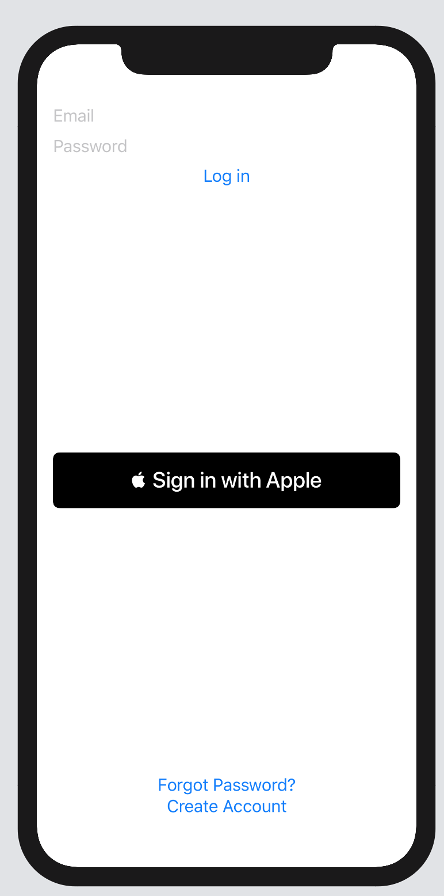
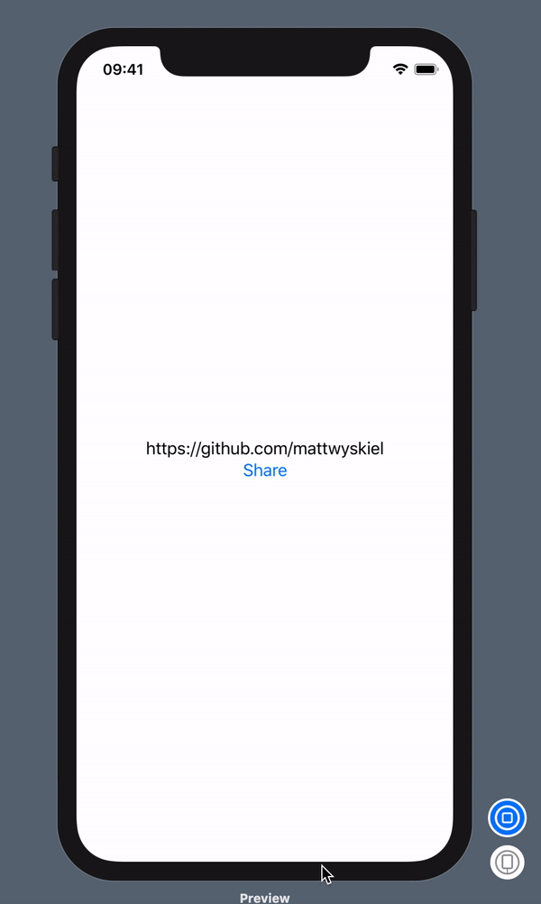
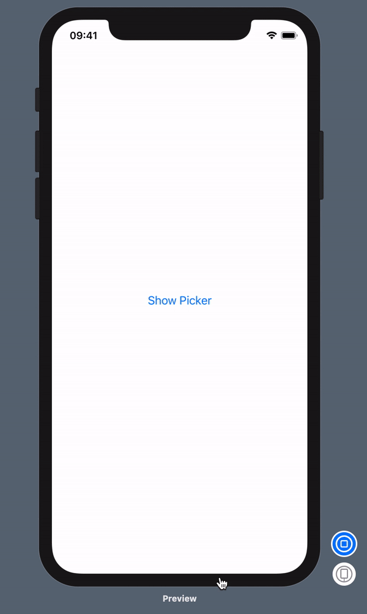
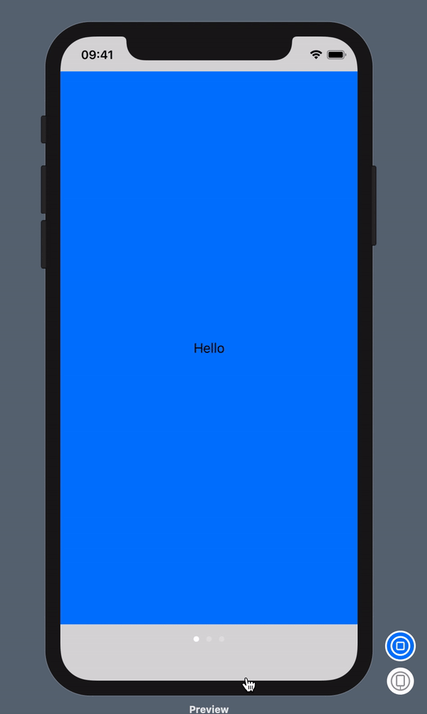

# JuiceUI

A small collection of what I thought would be useful SwiftUI wrappers for common views in the iOS SDK. The goal is to fill in the gap a bit between what Apple integrated into SwiftUI and the components iOS developers actually use.

This was also an excuse for me to play around with SwiftUI and release a Swift Package, so there's that.

## Installation
Simply go into you Xcode project, go to **File > Swift Packages > Add Package Dependency** and provide the URL to this repository (`https://github.com/mattwyskiel/JuiceUI.git`) and have it pull from **master**.

## Components

### Sign In With Apple button



Relevant code:

```swift
AppleIDAuthButton(requestedScopes: [.fullName, .email])
    .onSuccess({ /* success handler */ })
    .frame(height: 55)
```

### Share Sheet



Relevant code:

```swift
.sheet(isPresented: $showShareSheet) {
    ShareSheet(items: [URL(string: self.url)!])
    .onComplete { (activityType, completed, returnedItems, activityError) in
        /* completion handler */
    }
}
```

### Font Picker


Relevant code:

```swift
.sheet(isPresented: $showPicker) {
    NavigationView {
        FontPicker(didPickFont: { font in
            self.fontName = font.postscriptName // self.fontName is @State, so the text font updates automatically
        })
    }
}
```

### Image Picker



Relevant code:

```swift
.sheet(isPresented: $showPicker) {
    ImagePicker(sourceType: .photoLibrary) { info in
        self.imageURL = info[.imageURL] as? URL // updates the image automatically
    }
    .onCancel {
        self.imageURL = nil
    }
}
```

### Page View



Relevant code:

```swift
ZStack{
    Color.veryLightGray.edgesIgnoringSafeArea(.all) // so you can see the page indicator; also, veryLightGray is a custom color.
    PageView {
        Page {
            ZStack {
                Color.blue
                Text("Hello")
            }
        }
        Page {
            ZStack {
                Color.red
                Text("World")
            }
        }
        Page {
            Text("This Works!!!")
        }
    }
}
```

### Mail Composer

(no preview because this doesn't work in the simulator, and I've deleted the mail app on all my devices :grimacing:)

```swift
.sheet(isPresented: $isPresenting) {
    MailComposeView()
    .message(self.message)
    .didCancel {
        self.text = "cancelled"
    }
    .didSend {
        self.text = "sent"
    }
    .didFail { error in
        self.text = "Error: " + error.localizedDescription
    }
    .didSaveDraft {
        self.text = "saved draft"
    }
}
```

## Demo
Want to see all of this in more detail? See the `JuiceUI Previews.xcodeproj` in the `Demo` folder.

## License

```
Copyright 2019 Matthew Wyskiel

Licensed under the Apache License, Version 2.0 (the "License");
you may not use this file except in compliance with the License.
You may obtain a copy of the License at

  http://www.apache.org/licenses/LICENSE-2.0

Unless required by applicable law or agreed to in writing, software
distributed under the License is distributed on an "AS IS" BASIS,
WITHOUT WARRANTIES OR CONDITIONS OF ANY KIND, either express or implied.
See the License for the specific language governing permissions and
limitations under the License.
```
